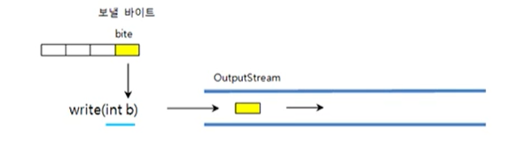
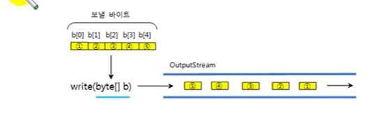
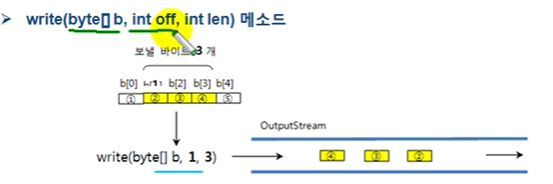

# OutputStream

OutputStream은 바이트 기반 출력 스트림의 최상위 클래스로 추상 클래스이다. 모든 바이트 기반 출력
스트림 클래스는 이 클래스를 상속받아서 만들어진다. 
다음과 같이 FileOutputStream, PrintStream, BufferedOutputStream, DataOutputStream 클래스는
모두  OutputStream 클래스를 상속하고 있다.


OutputStream 클래스에는 모든 바이트 기반 출력 스트림이 기본적으로 가져야 할 메소드가 정의 되어 있다.
다음은 OutputStream 클래스의 주요 메소드이다.

| 리턴 타입 | 메소드 | 설명 |
|---| :---:|---:|
void | write(int b) | 출력 스트림으로 1바이트를 보낸다(b의 끝 1바이트)
void | write(byte[] b) | 출력 스트림으로 주어진 바이트 배열 b의 모든 바이트를 보낸다.
void | write(byte[] b ,int off , int len) | 출력 스트림으로 주어진 바이트 배열b[off] 부터 len개 까지의 바이트를 보낸다.
void | flush() | 버퍼에 잔류하는 모든 바이트를 출력한다.
void | close() | 사용한 시스템 자원을 반납하고 출력 스트림을 닫는다.

## write(int b) 메소드

write(int b) 메소드는 매개 변수로 주어진 int 값에서 끝에 있는 1 바이트만 출력 스트림으로 보낸다.
매개 변수가 int 타입이므로 4바이트 모두를 보내는 것으로 오해 할 수 있다.



```java
OutputStream os = new FileOutputStream("C:/test.txt");
byte [] data = "ABC".getBytes();
for(int i=0; i<data.length; i++){
    os.write(data[i]);    // "A"  ,"B" , "C" 를 하나씩 출력
}
```

## wrtie(byte[] b) 메소드

write(byte[] b) 메소드는 매개값으로 주어진 바이트 배열의 모든 바이트를 출력 스트림으로 보낸다.




```java
OutputStream os = new FileOutputStream("C:/test.txt");
byte[ ] data = "ABC".getBytes();
os.write(data);  // "ABC" 모두 출력
```

## write(byte[] b , int off , int len) 메소드

write(byte[] b , int off , int len)은 b[off] 부터 len개의 바이트를 출력 스트림으로 보낸다.




```java
OutputStream os = new FileOutputStream("C:/test.txt");
byte[] data = "ABC".getBytes();
os.write(data,1,2); // "BC"만 출력 
```

## flush() 와 close() 메소드

출력 스트림은 내부에 작은 버퍼(buffer)가 있어서 데이터가 출력되기 전에 버퍼가 쌓여있다가 순서대로 출력된다.
flush() 메소드는 버퍼에 잔류하고 있는 데이터를 모두 출력시키고 버퍼를 비우는 역할을 한다.
프로그램에서 더 이상 출력할 데이터가 없다면 flush() 메소드를 마지막으로 호출하여 버퍼에 잔류하는 모든 데이터가
출력되도록 해야 한다. 프로그램에서 더 이상 출력할 데이터가 없다면 flush() 메소드를 마지막으로 호출하여 버퍼에
잔류하는 모든 데이터가 출력되도록 해야 한다. OutputStream을 더 이상 사용하지 않을 경우에는 close() 메소드를 호출해서
OutputStream에서 사용했던 시스템 자원을 풀어준다.

```java
OutputStream os = new FileOutputStream("C:/test.txt");
byte[] data = "ABC".getBytes();
os.write(data);
os.flush();
os.close();

```