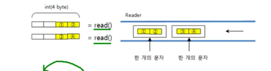
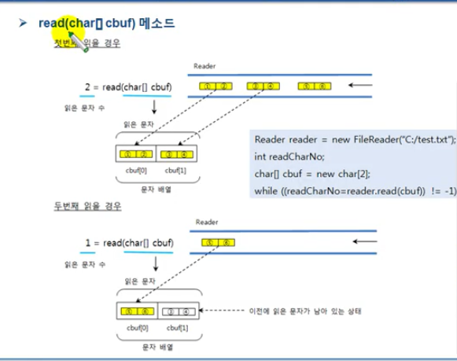
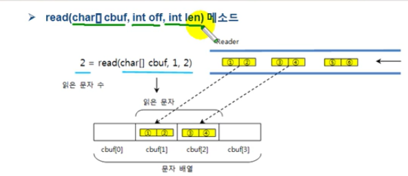

# Reader

Reader는 문자 기반 입력 스트림의 최상위 클래스로 추상 클래스이다. 모든 문자 기반 입력 스트림은 
이 클래스를 상속받아서 만들어진다. 다음과 같이 FileReader, BufferedReader, InputStreamReader 클래스는
모두 Reader 클래스를 상속하고 있다.


Reader 클래스에는 문자 기반 입력 스트림이 기본적으로 가저야 할 메소드가 정의되어 있다.

| 리턴타입 |메소드|설명|
|---| :---: | ---:|
| int | read()| 입력 스트림으로부터 한 개의 문자를 읽고 리턴한다.
| int | read(char[] cbuf) | 입력 스트림으로부터 읽은 문자들을 매개값으로 주어진 문자 배열 cbuf에 저장하고 실제로 읽은 문자 수를 리턴한다.
| int | read(char[] cbuf, int off , int len) | 입력 스트림으로부터 len개의 문자를 읽고 매개값으로 주어진 문자 배열 cbuf[off]부터 len개 까지 저장한다. 그리고 실제로 읽은 문자 수인 len개를 리턴한다.
|int|close() |사용한 시스템 자원을 반납하고 입력 스트림을 닫는다.


## read() 메소드

read() 메소드는 입력 스트림으로부터 한 개의 문자(2바이트)를 읽고 4바이트 int 타입으로 리턴한다.
따라서 리턴된 4바이트 중 끝에 있는 2바이트에 문자 데이터가 들어 있다. 예를 들어 입력 스트림에서 2개의 문자
(총 4바이트)가 들어온다면 다음과 같이 read()메소드로 한 문자식 두 번 읽을 수 있다.



read() 메소드가 리턴한 int 값을 char 타입으로 변환하면 읽은 문자를 얻을 수 있다. 
```java
char charData = (char) read();
```

더 이상 입력 스트림으로 부터 문자를 읽을 수 없다면 read() 메소드는 -1을 리턴하는데 이것을 이용하면 읽을 수 있는 마지막
문자까지 루프를 돌며 한 문자씩 읽을 수 있다.

```java
Reader reader = new FileReader("C:/test.txt");
int readData;
while((readData = reader.read()) != -1){
    char charData = (char) readData;
    
}
```

## read(char[] cbuf) 메소드

read(char[] cbuf) 메소드는 입력 스트림으로부터 매개값으로 주어진 문자 배열의 길이만큼 문자를 읽고 배열에 저장한다.
그리고 읽은 문자 수를 리턴한다. 실제로 읽은 문자 수가 배열의 길이보다 작을 경우 읽은 수만큼만 리턴한다.
예를 들어 입력 스트림에서 세 개의 문자가 들어온다면 다음과 같이 길이가 2인 문자 배열로 두 번 읽을 수 있다.



read(char[] cbuf) 역시 입력 스트림으로부터 문자를 더 이상 읽을 수 없다면 -1을 리턴한다.
이것을 이용하면 읽을 수 있는 마지막 문자까지 루프를 돌며 읽을 수 있다.

```java
Reader reader = new FileReader("C:/test.txt");
int readCharNo;
char[] cbuf = new char[2];
while((readCharNo = reader.read(cbuf)) != -1){
    
}
```

입력 스트림으로부터 100개의 문자가 들어온다면 read() 메소드는 100번을 루핑해서 읽어들여야 한다.
그러나 read(char[] cbuf) 메소드는 한 번 읽을 때 주어진 배열 길이만큼 읽기 때문에 루핑 횟수가 현저히 줄어든다. 
그러므로 많은 양의 문자를 읽을 때는 read(char[] cbuf) 메소드를 사용하는 것이 좋다.

## read(char[] cbuf , int off , int len) 메소드

read(char[] cbuf , int off , int len) 메소드는 입력 스트림으로부터 len개의 문자만큼 읽고
매개값으로 주어진 문자 배열 cbuf[off]부터 len개까지 저장한다. 그리고 읽은 문자 수인 len개를 리턴한다.
실제로 일은 문자 수가 len개보다 작을 경우 읽은 수만큼 리턴한다. 예를 들어 입력 스트림에서 전체 3개의 문자가 들어오고,
여기서 2개만 읽고 cbuf[1].cbuf[2]에 각각 저장한다면 다음과 같이 할 수 있다.




```java
Reader reader = ...;
char [] cbuf = new char[100];
int readCharNo = reader.read(cbuf);

-----------------------------------

Reader reader = ...;
char[] cbuf = new char[100];
int readCharNo = reader.read(cbuf,0,100);
```

## close() 메소드

마지막으로 Reader를 더 이상 사용하지 않을 경우에는 close() 메소드를 호출해서 Reader에서 사용했던 시스템 자원을 풀어준다.