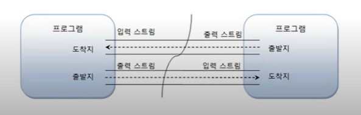

# 입력 스트림과 출력 스트림

프로그램이 출발지냐 또는 도착지냐에 따라서 스트림의 종류가 결정되는데, 프로그램이
데이터를 입력 받을 때에는 입력 스트림(InputStream)이라 부르고, 프로그램이
데이터를 보낼 때에는 출력 스트림(OutputStream)이라고 부른다.

입력 스트림이 출발지는 키보드, 파일 , 네트워크상의 프로그램이 될 수 있고,
출력 스트림의 도착지는 모니터, 파일 , 네트워크상의 프로그램이 될 수 있다.

항상 프로그램을 기준으로 데이터가 들어오면 입력 스트림이고, 데이터가 나가면
출력 스트림이라는 것을 명심해야 한다. 프로그램이 네트워크상의 다른 프로그램과 
데이터 교환을 하기 위해서는 양쪽 모두 입력 스트림과 출력 스트림이 따로 필요하다.

스트림의 특성이 단방향이므로 하나의 스트림으로 입력과 출력을 모두 할 수 없기 때문이다.

한 예로 , 프로그램 A 와 프로그램 B가 있다고 가정 하자
프로그램 A가 데이터를 입력스트림을 받으려고 할 때 일단, 우선적으로
프로그램 B가 출력스트림으로 데이터를 보내줘야 받을 수 있다.

자바의 기본적인 데이터 입출력 API는 java.io 패키지에서 제공하고 있다.

java.io 패키지에는 파일 시스템의 정보를 얻기 위한 File 클래스와 
데이터를 입출력하기 위한 다양한 입출력 스트림 클래스를 제공하고 있다.

*****

### java.io 패키지의 주요 클래스

파일 시스템의 파일 정보를 얻기 위한 클래스
- File

콘솔로부터 문자르 입출력하기 위한 클래스
- Console

바이트 단위 입출력을 위한 최상위 입출력 스트림 클래스( 바이트를 읽고 쓰기위해서 사용한다.)

- InputStream / OutputStream

바이트 단위 입출력을 위한 하위 스트림 클래스

- FileInputStream / FileOutputStream
- DataInputStream / DataOutputStream
- ObjectInputStream / ObjectOutputStream
- PrintStream 
- BufferedInputStream / BufferedOutputStream

문자 단위 입출력을 위한 최상위 입출력 스트림 클래스

- Reader / Writer

문자 단위 입출력을 위한 하위 스트림 클래스

- FileReader / FileWriter
- InputStreamReader / OutputStreamWriter
- PrintWriter
- BufferedReader / BufferedWriter

스트림 클래스는 크게 두 종류로 구분된다. 하나는 바이트(byte) 기반 스트림이고,
다른 하나는 문자(character) 기반 스트림이다. 바이트 기반 스트림은 그림 , 멀티미디어 ,
문자 등 모든 종류의 데이터를 받고 보낼 수 있으나, 문자 기반 스트림은 오로지 문자만
받고 보낼 수 있도록 특화되어 있다. 

바이트 기반 스트림과 문자 기반 스트림은 최상위 클래스에 따라서 다음과 같이 구분된다.

### 바이트 기반 스트림
- 최상위 클래스 : InputStream / OutputStream
- 하위 클래스 : XXXInputStream / XXXOutputStream

### 문자 기반 스트림
- 최상위 클래스 : Reader / Writer
- 하위 클래스 : XXXReader / XXXWriter

InputStream은 바이트 기반 입력 스트림의 최상위 클래스이고,
OutputStream은 바이트 기반 출력 스트림의 최상위 클래스이다.
이 클래스들을 각각 상속받는 하위 클래스는 접미사로 InputStream 또는
OutputStream이 붙는다. Reader는 문자 기반 입력 스트림의 최상위 클래스이고,
Writer는 문자 기반 출력 스트림의 최상위 클래스이다. 이 클래스들을
각각 상속받는 하위 클래스는 접미사로 Reader 또는 Writer가 붙는다.

예를 들어, 그림, 멀티 미디어, 텍스트 등의 파일을 바이트 단위로 읽어들일 때에는 
FileInputStream을 사용하고 , 바이트 단위로 저장할 때에는 FileOutputStream 을 
사용한다. 

텍스트 파일의 경우, 문자 단위로 읽어 들일 때에는 FileReader 를 사용하고,
문자 단위로 저장할 때에는 FileWriter 를 사용한다.

