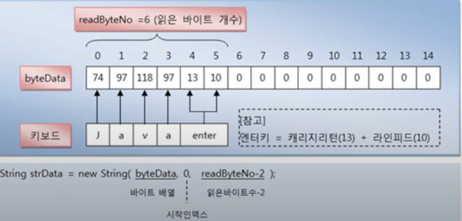

# System.in 필드

자바는 프로그램이 콘솔로부터 데이터를 입력받을 수 있도록 System 클래스의
in 정적 필드를 제공하고 있다. 

System.in은 InputStream 타입의 필드이므로 다음과 같이 InputStream 변수로
참조가 가능하다.

```java
InputStream is = System.in;
```
키보드로부터 어떤 키가 입력되었는지 확인하려면 InputStream의 read() 메소드로
한 바이트를 읽으면 된다. 리턴된 int 값에는 십진수 아스키 코드(Ascii Code)가
들어 있다. 

```java
int asciiCode = is.read();
```
컴퓨터는 0과 1만을 이해할 수 있다. 그래서 미죽표준협회가 컴퓨터에서
문자를 숫자로 매칭하는 방법을 표준화시킨 것이 아스키 코드이다. 
아스키 코드는 1byte로 표현되는 256가지의 숫자에  영어 알파벳 , 아라비아 숫자,
특수 기호를 매칭하고 있다. 만약 키보드에서 a를 입력하고 Enter키를 눌렀다면
a키의 97번과 Enter키의 13, 10번이 차례대로 읽혀진다. Enter키는 캐리지 리턴
(carriage return:13) 과 
라인 피드 코드(line feed:10)가 결합된 키라고 볼 수 있다. 
숫자로된 아스키 코드 대신에 키보드에서 입력한 문자를 직접 얻고 싶다면
read() 메소드로 읽은 아스키 코드를 cha로 타입 변환하면 된다.
```java
char inputChar = (char) is.read();
```

예를 들어 read() 메소드로 읽은 아스키 코드 97번을 다음과 같이 char 타입으로
변환하면 'a' 문자를 얻을 수 있다.

```java
char inputChar = (char) 97;
```

다음은 ATM과 비슷하게 사용자에게 메뉴를 제공하고 사용자가 어떤 번호를 입력했는지
알아내는 예제이다.

`SystemInExample1.java`

```java

public class SystemInExample1 {
    public static void main(String[] args) throws IOException {
        System.out.println(" == 메뉴 ==");
        System.out.println("1. 예금 조회");
        System.out.println("2. 예금 출금");
        System.out.println("3. 예금 입금");
        System.out.println("4. 종료 하기");

        InputStream is = System.in;

        char inputChar = (char) is.read();
        switch (inputChar){
            case '1':
                System.out.println("예금 조회를 선택하셨습니다.");
                break;
            case '2':
                System.out.println("예금 출금을 선택하셨습니다.");
                break;
            case '3':
                System.out.println("예금 입금을을 선택하셨습니다.");
                break;
            case '4':
                System.out.println("종료하기를 선택하셨습니다.");
                break;
        }
    }
}
```

InputStream의 read() 메소드는 1바이트만 읽기 때문에 1바이트의
아스키 코드로 표현되는 숫자, 영어 , 특수문자는 프로그램에서 잘 읽을 수 있지만
한글과 같이 2바이트를 필요로 하는 유니코드는 read() 메소드로 읽을 수 없다.

키보드로 입력된 한글을 얻기 위해서는 우선 read[byte[] b) 나 
read(byte[]b , int off , int len) 메소드로 전체 입력된 내용을
바이트 배열로 받고, 이 배열을 이용해서 String 객체를 생성하면 된다.
read(byte[] b) 메소드를 사용하기 전에 우선 키보드에서 입력한 문자를
저장할 바이트 배열을 만들어야 한다.  바이트 배열의 길이는 읽어야 할
바이트 수를 고려해서 적절히 주면 되는데, 영어 한 문자는 1바이트 ,
한글 한 문자는 2바이트를 차지하므로 최대 영문자 15자 또는 한글 7자를 
저장하려면 다음과 같이 바이트 배열을 선언하면 된다. 

```java
byte[] byteData = new byte[15];
```

다음과 같이 생성된 배열을 read(byte[] b) 메소드의 매개값으로 주면
키보드에서 입력한 문자를 저장할 수 있게 된다. 

```java
int readByteNo = System.in.read(byteData);
```

read(byte[] b) 메소드는 매개값으로 주어진 바이트 배열에 읽은 문자를 저장하고
실제로 읽은 바이트 개수를 리턴한다. read(byte[] b) 메소드가 동작하는
방법을 그림을 통해 이해해보자 키보드에서 
"Java"라고 입력하고 Enter 키를 누르면 바이트 배열에 저장되는 값과
리턴값은 다음과 같다.




프로그램에서 바이트 배열에 저장된 아스키 코드를 사용하려면 문자열로 변환해야 한다.
변환할 문자열은 바이트 배열의 0번 인덱스에서 읽은 바이트 수-2만큼이다.

2를 빼는 이유는 Enter 키에 해당하는 마지막 두 바이트를 제외하기 위해서이다.
바이트 배열을 문자열로 변환할 때에는 다음과 같이 String 클래스의
생성자를 이용한다.

```java
String strData = new String(byteData , 0 , readByteNo-2);
```

다음은 이름과 하고 싶은 말을 키보드로 입력받아 다시 출력하는 예제이다.

````java

public class SystemInExample2 {
    public static void main(String[] args) throws IOException {
        InputStream is = System.in;


        byte[ ] datas = new byte[100];

        System.out.println("이름 : ");
        int nameBytes = is.read(datas);
        String name = new String(datas, 0 ,nameBytes-2);

        System.out.println("하고 싶은 말:");
        int commentBytes = is.read(datas);
        String comment = new String(datas, 0 , commentBytes-2);


        System.out.println("입력한 이름 : " +name);
        System.out.println("입력한 하고 싶은 말 : " +comment);
    }
}

````
