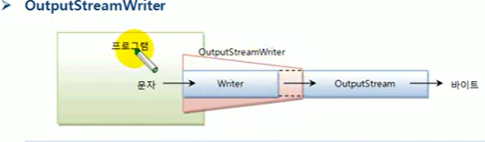

# 문자 변환 보조 스트림

소스 스트림이 바이트 기반 스트림(InputStream, OutputStream , 
FileInputStream)이면서 입출력 데이터가 문자라면 Reader와
Writer로 변환해서 사용하는 것을 고려해야 한다. 그 이유는
Reader와 Writer는 문자 단위로 입출력하기 때문에 바이트 기반 스트림보다는
편리하고, 문자셋의 종류를 지정할 수 있기 때문에 
다양한 문자를 입출력할 수 있다. 

## InputStreamReader
InputStreamReader는 바이트 입력 스트림에 연결되어 문자 입력 스트림인
Reader로 변환시키는 보조 스트림이다.


```java
Reader reader = new InputStreamReader(바이트입력스트림);
```

예를 들어 콘솔 입력을 위한 InputStream을 다음과 같이 Reader 타입으로
변환할 수 있다.

```java
InputStream is = System.in;
Reader reader = new InputStreamReader(is);
```

파일 입력을 위한 FileInputStream도 다음과 같이 Reader 타입으로
변환 시킬 수 있다.

```java
FileInputStream fis = new FileInputStream("C:/Temp/file.txt");
Reader reader = new InputStreamReader(fis);
```

FileInputStream에 InputStreamReader를 연결하지 않고 FileReader를
직접 생성할 수 도 있다. FileReader는 InputStreamReader의 하위 클래스
이다. 이것은 FileReader 가 내부적으로 FileInputStream에 
InputStreamReader 보조 스트림을 연결한 것이라고 볼 수 있다.
다음은 콘솔에서 입력한 한글을 Reader를 이용해서 읽고,
다시 콘솔로 출력하는 예제이다.

`InputStreamReaderExample.java` 콘솔에서 한글 입력 받기

```java

public class InputStreamReaderExample {
    public static void main(String[] args) throws IOException {
        InputStream is = System.in;
        Reader reader = new InputStreamReader(is);

        int readCharNo;
        char[] cbuf = new char[100];
        while ( (readCharNo=reader.read(cbuf)) != -1){

            String data = new String(cbuf,0,readCharNo);
            System.out.println(data);
        }
        reader.close();
    }
}

```

OutputStreamWriter

OutputStreamWriter는 바이트 출력 스트림에 연결되어 문자 출력 스트림인
Writer로 변환시키는 보조 스트림이다.



```java
Writer writer = new OutputStreamWriter(바이트출력스트림);
```

예를 들어 파일 출력을 위한 FileOutputStream을 다음과 같이 Writer 
타입으로 변환할 수 있다.

```java
FileOutputStream fos = new FileOutputStream("C:/Temp/file.txt");
Writer writer = new OutputStreamWriter(fos);
```
FileOutputStream에 OutputStreamWriter를 연결하지 않고 FileWriter
를 직접 생성할 수 도 있다. FileWriter는 OutputStreamWriter의
하위 클래스이다. 이것은 FileWriter가 내부적으로 FileOutputStream에
OutputStreamWriter 보조 스트림을 연결한 것으로 볼 수 있다.
다음은 FileOutputStream을 Writer로 변환해서 문자열을 파일에 저장한다.

`OutputStreamWriterExample.java` 파일로 출력하기

```java

public class OutputStreamWriterExample {
    public static void main(String[] args) throws IOException {
        FileOutputStream fos = new FileOutputStream("C:\\Temp/hello.txt");

        Writer writer = new OutputStreamWriter(fos);

        String data = "바이트 출력 스트림을 문자 출력 스트림으로 변환";
        writer.write(data);

        writer.flush();
        writer.close();
        System.out.println("파일 저장이 끝났습니다.");
    }
}

```