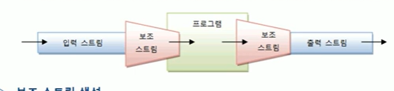

# 보조 스트림

보조 스트림이란 다른 스트림과 연결되어 여러 가지 편리한 기능을 제공해주는 스트림을 말한다.
보조 스트림을 필터 스트림이라고도 하는데, 이는 보조 스트림의 일부가 FilterInputStream,
FilterOutputStream의 하위 클래스이기 때문이다. 

하지만 다른 보조 스트림은 이 클래스들을 상속받지 않기 때문에 필터 스트림이란
용어 대신 보조 스트림이라고 하겠다.

보조 스트림은 자체적으로 입출력을 수행할 수 없기 때문에 입력 소스와 바로
연결되는 InputStream, FileInputStream , Reader , FileReader,
출력 소스와 바로 연결되는 OutputStream, FileOutPutStream, Writer ,
FileWriter 등에 연결해서 입출력을 수행한다. 
보조 스트림은 문자 변환, 입출력 성능 향상, 기본 데이터 타입 입출력,
객체 입출력 등의 기능을 제공한다. 다음은 입력 스트림과 출력 스트림에
보조 스트림을 연결한 모습을 가상화시킨 것이다.



보조 스트림을 생성할 때에는 자신이 연결될 스트림을 다음과 같이
생성자의 매개값으로 받는다.

```java
보조스트림 변수 = new 보조스트림(연결스트림)
```

예를 들어 콘솔 입력 스트림을 문자 변한 보조 스트림인 InputStreamReader에
연결하는 코드는 다음과 같다

```java
InputStream is = System.in;
InputStreamReader reader = new InputStreamReader(is);
BufferedReader br = new BufferedReader(reader);
```
다음 그림을 보면 보조 스트림은 또 다른 보조 스트림에도
연결되어 스트림 체인을 구성할 수 있다.


예를 들어 문자 변환 보조 스트림은 InputStreamReader를 다시 성능 향상
보조 스트림인 BufferedReader에 연결하는 코드는 다음과 같다.

```java
InputStream is = System.in;
InputStreamReader reader = new InputStreamReader(is);
BufferedReader br = new BufferedReader(reader);
```