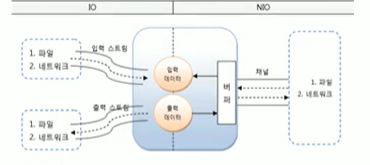

# IO와 NIO의 차이점

IO와 NIO는 데이터를 입출력한다는 목적은 동일하지만, 방식에 있어서 크게 차이가 난다.
아래 표는 IO와 NIO의 차이점을 정리한 것이다. 

|구분|IO|NIO
|----|:----|----
|입출력 방식|스트림 방식 |채널 방식
|버퍼 방식 | 넌버퍼(non-buffer)|버퍼(buffer)
|비동기 방식 | 지원 안함 | 지원
|블로킹/넌블로킹 방식| 블로킹 방식만 지원 | 블로킹 / 넌블로킹 방식 모두 지원

### 스트림 vs 채널

IO는 스트림(Straem)기반이다. 스트림은 입력 스트림과 출력 스트림으로 구분되어 있기 때문에 
데이터를 읽기 위해서는 입력 스트림을 생성해야 하고, 데이터를 출력하기 위해서는 출력 스트림을 생성해야 한다.
예를 들어 하나의 파일에서 데이터를 읽고 저장하는 작업을 모두 해야 한다면 FileInputStream 과
FileOutputStream을 별도로 생성해야 한다. 

NIO는 채널(Channel ) 기반이다. 채널은 스트림과 달리 양방향으로 입력과 출력이 가능하다. 그렇기 때문에
입력과 출력을 위한 별도의 채널을 만들 필요가 없다. 예를 들어 하나의 파일에서 데이터를 읽고 저장하는 작업을
모두 해야 한다면 FileChannel 하나만 생성하면 된다.

### 넌버퍼 VS 버퍼

IO에서는 출력 스트림이 1바이트를 쓰면 입력 스틀미이 1바이트를 읽는다. 이런 시스템은 대체로 느리다. 
이것보다는 버퍼(Buffer: 메모리 저장소)를 사용해서 복수 개의 바이트를 한꺼번에 입력받고 출력하는 것이
빠른 성능을 낸다. 그래서 IO는 버퍼를 제공해주는 보조 스트림인 BufferedInputStream, BufferedOutputStream
을 연결해서 사용하기도 한다. NIO는 기본적으로 버퍼를 사용해서 입출력을 하기 때문에 IO 보다는 
입출력 성능이 좋다. 채널은 버퍼에 저장된 데이터를 출력하고, 입력된 데이터를 버퍼에 저장한다.

IO는 스트림에서 읽은 데이터를 즉시 처리한다. 그렇기 때문에 스트림으로부터 입력된 전체 데이터를 
별도로 저장하지 않으면, 입력된 데이터의 위치를 이동해 가면서 자유롭게 이동할 수 없다.

NIO는 읽은 데이터를 무조건 버퍼에 저장하기 때문에 버퍼 내에서 데이터의 위치를 이동해 가면서
필요한 부분만 읽고 쓸 수 있다.

### 블로킹 vs 넌블로킹

IO는 블로킹(blocking) 된다. 입력 스트림의 read() 메소드를 호출하면 데이터가 입력되기 전까지
스레드는 블로킹(대기 상태)된다. 마찬가지로 출력 스트림의 write() 메소드를 호출하면 데이터가 출력되기 전까지
스레드는 블로킹된다. IO 스레드가 블로킹되면 다른 일을 할 수 없고 블로킹을 빠져나오기 위해 
인터럽트(interrupt)도 할 수 없다. 블로킹을 빠져나오는 유일한 방법은 스트림을 닫는 것이다.
NIO는 블로킹과 넌블로킹(non-blocking) 특징을 모두 가지고 있다. IO 블로킹과의 차이점은
NIO 블로킹은 스레드를 입터럽트함으로써 빠져나올 수가 있다는 것이다. 블로킹의 반대 개념이 넌블로킹인데,
입출력 작업 시 스레드가 블로킹도지 않는 것을 말한다. NIO의 넌블로킹은 입출력 작업 준비가 완료된 채널만
선택해서 작업 스레드가 처리하기 때문에 작업 스레드가 블로킹되지 않는다. 여기서 작업 준비가 완료되었다는
뜻은 지금 바로 읽고 쓸 수 있는 상태를 말한다. NIO 넌블로킹의 핵심 객체는 멀티플렉서(multiplexor)인
셀렉터(Selector)이다. 셀렉터는 복수 개의 채널 중에서 준비 완료된 채널을 선택하는 방법을 제공해준다.

