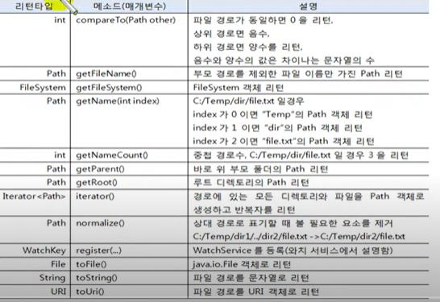

# 파일과 디렉토리

IO는 파일의 속성 정보를 읽기 위해 File 클래스만 제공하지만, NIO는 좀 더 다양한 파일의 속성 정보를
제공해주는 클래스와 인터페이스를 java.nio.file, java.nio.file.attribute 패키지에서 제공하고 있다.


## 경로 정의(Path)

NIO에서 제일 먼저 살펴봐야 할 API는 java.nio.file.Path 인터페이스이다. Path는 IO의 java.io.File
클래스에 대응되는 NIO 인터페이스이다. NIO의 API에서 파일의 경로를 지정하기 위해 Path를 사용하기 때문에
Path 사용 방법을 잘 익혀두어야 한다. Path 구현 객체를 얻기 위해서는 java.nio.file.Paths 클래스의
정적 메소드인 get() 메소드를 호출하면 된다.

```java
Path path = Paths.get(String first , String... more)
Path path = Paths.get(URI uri);
```

get() 메소드의 매개값은 파일의 경로인데, 문자열을 지정할 수도 있고, URI 객체로 지정할 수도 있다.
문자열로 지정할 경우 전체 경로를 한꺼번에 지정해도 좋고, 상위 디렉토리와 하위 디렉토리를 나열해서
지정해도 좋다. 다음은 "C:\Temp\dir\file.txt" 경로를 이용해서 Path 객체를 얻는 방법을 보여준다.

```java
Path path = Paths.get("C:/Temp/dir/file.txt");
Path path = Paths.get("C:/Temp/dir","file.txt");
Path path = Paths.get("C:", "Temp", "dir","file.txt");
```

파일의 경로는 절대 경로와 상대 경로를 모두 사용할 수 있다. 만약 현재 디렉토리 위치가 "C:\Temp"일 경우
"C:\Temp\dir\file.txt"는 다음과 같이 지정이 가능하다.
```java
Path path = Paths.get("dir/file.txt");
Path path = Paths.get("./dir/file.txt");
```

현재 위치가 "C:\Temp\dir1" "C:\Temp\dir2\file.txt"는 다음과 같이 지정이 가능하다.

```java
Path path = Paths.get("../dir2/file.txt");
```

Path 인터페이스에는 다음과 같이 파일 경로에서 얻을 수 있는 여러 가지 정보를 제공해주는 메소드가 있다.




`PathExample.java` Path 인터페이스 사용


```java
public class PathExample {

    public static void main(String[] args) {

        Path path = Paths.get("src/chap19/exam01_path/PathExample.java");
        System.out.println("파일명 : " + path.getFileName());
        System.out.println("부모 디렉토리명 : "+ path.getParent().getFileName());
        System.out.println("중첩 경로 수 : " +path.getNameCount());

        System.out.println();

        for (int i=0; i<path.getNameCount(); i++){
            System.out.println(path.getName(i));
        }

        System.out.println();

        Iterator<Path> iterator = path.iterator();
        while (iterator.hasNext()){
            Path temp = iterator.next();
            System.out.println(temp.getFileName());
        }
    }
}

```